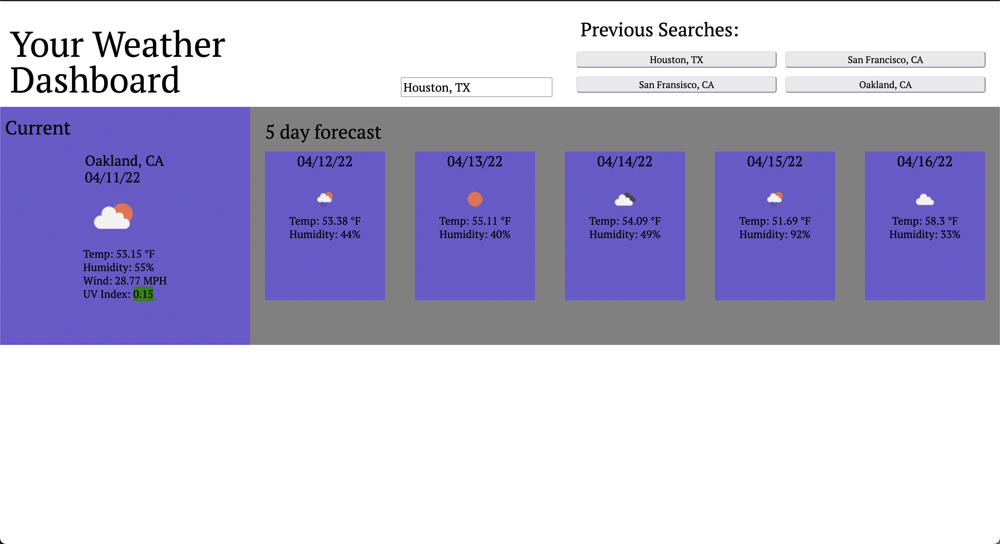

# Weather Dashboard

## Description 
The goal of this application is to provide the user with weather information for cities of their choosing. The cities that the user inputs are saved in local memory, and weather data is populated using the Open Weather API. 


## Link and Preview of the site

[Click to view the live application](https://sharkby7e.github.io/weatherDashboard/)



## Technologies Employed

| Techlogy      | Implementation/Use          |
|:-------------:|-----------------------------|
|HTML           | Structure of Webpage        |
|jQuery         | Dynamic DOM manipulation    |
|OpenWeatherAPI | Dynamically updating the DOM|
|Moment.js      | Time and Date support       |

## Key Functions

### fetchGeo 

This function read in information from either the user submitted form, or the buttons that were populated from localStorage.
This was the first main fetch call in the program, and converted a City, ST input into longitude and latitude information, 
which was needed by the OpenWeatherAPI to gather forecast information

```javascript
function fetchGeo(cityState) {
  var city = cityState[0].trim()
  var state = cityState[1].trim()
  var fetchGeocoding = "https://api.openweathermap.org/geo/1.0/direct?q=" + city + ',' + state + ",US&limit=5&appid=" + owa
  fetch(fetchGeocoding)
    .then(response => response.json()).then(data=>{
      lat = data[0].lat
      lon = data[0].lon
      fetchWeather(lat,lon)
    })
}
```

### fetchWeather

This function was the heart of this application. It took longitude, and latitude data from the previous call, 
passed it into a new API call, and then populated a new object called weatherObj. Instead of storing all of the weather
information in local storage, the only thing that was stored was an array of arrays, containing the City and State Code, 
which would pass through these two functions to populate the weatherObj with fresh data every time the user either clicked
a button from the history, or submitted a new search. After all the data was fetched, and weatherObj was populated, 
it was passed to the displayWeather function, which would in turn populate the whole page with the forecast information.

```javascript
function fetchWeather(x,y) {
  var fetchLink = "https://api.openweathermap.org/data/2.5/onecall?lat=" + x + "&lon=" + y + "&exclude=minutely,hourly&units=imperial&appid=" + owa
  var weatherObj = {}
  fetch(fetchLink)
    .then(response => response.json()).then(data => {
      // console.log(data)
      weatherObj = {
        city: loc,
        current: {
          //icon, date, humidity, wind, uv index(formatted)
          date: today.format('MM/DD/YY'),
          icon: data.current.weather[0].icon,
          temp: data.current.temp + ' °F',
          hum: data.current.humidity + '%',
          wind: data.current.wind_speed,
          uv: data.current.uvi
        },
      }
      var future = []
      for(let i = 0; i < 5; i++){
        var futWeath = {
          //date, icon, temp, humidity
          date: today.add(1,'d').format('MM/DD/YY'),
          temp: data.daily[i].temp.max,
          icon: data.daily[i].weather[0].icon,
          hum: data.daily[i].humidity + "%"
        }
        future.push(futWeath)
      }
      weatherObj.future=future
      // console.log(weatherObj)
      displayWeather(weatherObj)

  })
}
```
## Summary and Learning Points
This greenfield project was a great opportunity to learn how to use ServerSide API's. It was also a good opportunity
to work with objects. This data-structure was extremely useful for handling different types of data, and I definitely 
became more familiar with navigating and working with objects throughout this project. The majority of the work was spent
organizing information, and my experience with displaying content came in handy, and was much easier this time around, 
compared to other projects. I barely had to struggle with putting content on the page in the way that I wanted. I wish
I could've added a better way to filter/work with user inputs. The application only works if the user spells correctly, 
and uses the correct punctuation. 
